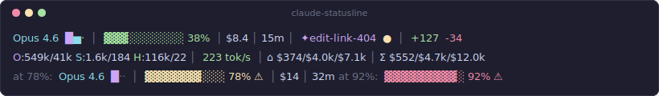

# Claude Code Status Line

[](https://github.com/ridjex/claude-code-statusline/actions/workflows/ci.yml)

Rich terminal status bar for Claude Code sessions — model usage, context window, costs, git state, and cumulative spend tracking.

<picture>
  <source media="(prefers-color-scheme: dark)" srcset="assets/demo-dark.svg">
  <source media="(prefers-color-scheme: light)" srcset="assets/demo-light.svg">
  
</picture>

> Demo images are auto-generated from test fixtures. Run `make demo` to regenerate after changing output format.

## Install

```bash
brew install jq                    # bc and git are pre-installed on macOS

git clone https://github.com/ridjex/claude-code-statusline.git
cd claude-code-statusline
make install                       # installs scripts + configures settings.json
```

Verify it works (run inside any git repo):

```bash
make verify
```

Then open a new Claude Code session.

## Uninstall

```bash
make uninstall                     # removes scripts, caches, and settings.json entry
```

## Configuration

Edit `~/.claude/statusline.env` to toggle sections (created by `make install`):

```bash
STATUSLINE_SHOW_MODEL=true        # Model name
STATUSLINE_SHOW_MODEL_BARS=true   # Mini bars (█▅▃)
STATUSLINE_SHOW_CONTEXT=true      # Context window bar
STATUSLINE_SHOW_COST=true         # Session cost
STATUSLINE_SHOW_DURATION=true     # Wall clock time
STATUSLINE_SHOW_GIT=true          # Branch + dirty
STATUSLINE_SHOW_DIFF=true         # Lines +/-
STATUSLINE_LINE2=true             # Show Line 2
STATUSLINE_SHOW_TOKENS=true       # Token counts
STATUSLINE_SHOW_SPEED=true        # tok/s throughput
STATUSLINE_SHOW_CUMULATIVE=true   # ⌂/Σ cost tracking
```

Set any value to `false` to hide that section. Changes apply on next render (no restart needed).

### CLI Arguments

Pass `--no-<section>` flags to hide sections:

```bash
~/.claude/statusline.sh --no-git --no-cumulative
```

To use with Claude Code, edit `~/.claude/settings.json`:
```json
{
  "statusLine": {
    "type": "command",
    "command": "~/.claude/statusline.sh --no-git --no-cumulative",
    "padding": 0
  }
}
```

Run `~/.claude/statusline.sh --help` for all options.

Config precedence: **CLI args > env vars > `~/.claude/statusline.env` > defaults (all on)**

## Development

```bash
make                  # show all targets
make test             # run test suite
make test-verbose     # shows rendered output for each scenario
make demo             # regenerate demo SVGs
make check            # verify dependencies
make diagnose         # check installation health
```

## Line 1

```
Opus 4.6 █▅▃ │ ▓▓▓░░░░░░░ 38% │ $8.4 │ 15m │ ✦edit-link ● │ +127 -34
\_model_/ ^^^   \__context__/     cost   dur   \___git___/     \_diff_/
          │││
          │││  Mini bars — model mix by output tokens
          ││└─ Haiku  (green)
          │└── Sonnet (cyan)
          └─── Opus   (magenta)
```

| Segment | Example | Description |
|---------|---------|-------------|
| Model | `Opus 4.6` | Active model, `Claude ` prefix stripped |
| Mini bars | `█▅▃` | Bar height = relative output tokens. `·` = not used |
| Context | `▓▓▓░░░░░░░ 38%` | 10-char bar. Yellow `⚠` at 70%, red `⚠` at 90% |
| Cost | `$8.4` | Session cost. `$12.0k` for >= $1000 |
| Duration | `15m` | Wall clock. `4h0m` for >= 60min |
| Git | `✦edit-link ●` | Branch with icon, `●` dirty, `↑↓` ahead/behind, `⊕` worktree |
| Diff | `+127 -34` | Lines added/removed |

Branch icons: `★` feature, `✦` fix, `⚙` chore, `↻` refactor, `§` docs

## Line 2

```
O:549k/41k S:180k/25k H:45k/15k │ 69 tok/s │ ⌂ $374/$4.0k/$7.1k │ Σ $552/$4.7k/$12.0k
\______per-model tokens________/   speed      \__this project__/     \___all projects__/
                                                day / week / month     day / week / month
```

| Segment | Example | Description |
|---------|---------|-------------|
| Tokens | `O:549k/41k S:180k/25k` | Per-model in/out. Only used models shown |
| Speed | `69 tok/s` | Output throughput. Green >30, yellow 15-30, red <15 |
| `⌂` | `$374/$4.0k/$7.1k` | This project: day/week/month cost |
| `Σ` | `$552/$4.7k/$12.0k` | All projects: day/week/month cost |

## How it works

Claude Code pipes JSON to `statusline.sh` via stdin on every render cycle.

```
stdin JSON ──> statusline.sh ──> 2 formatted lines (stdout)
                  │
                  ├── reads cached model stats (models-{session}.json)
                  ├── reads cached cumulative costs (proj-*.json, all.json)
                  ├── reads git state (branch, dirty, ahead/behind)
                  │
                  └── spawns 2 background jobs (non-blocking):
                        ├── parse transcript → update model cache
                        └── cumulative-stats.sh → update cost caches
```

- Render: ~5ms (reads JSON caches, no parsing)
- Background model parse: ~50-100ms
- Background cost scan: ~2-14s (depends on transcript volume, cached 5min)

## Files

```
~/.claude/
  statusline.sh          # main renderer
  cumulative-stats.sh    # background cost aggregator

~/.cache/claude-code-statusline/
  models-{session}.json  # per-session model tokens (auto-created)
  proj-{hash}.json       # per-project cost cache (auto-created)
  all.json               # all-projects cost cache (auto-created)
```

## Formatting rules

| Type | Range | Format | Example |
|------|-------|--------|---------|
| Cost | >= $1000 | `$X.Xk` | `$12.0k` |
| Cost | >= $10 | `$X` | `$374` |
| Cost | >= $1 | `$X.X` | `$8.4` |
| Cost | < $1 | `$X.XX` | `$0.12` |
| Tokens | >= 1M | `X.XM` | `1.2M` |
| Tokens | >= 10k | `Xk` | `45k` |
| Tokens | >= 1k | `X.Xk` | `1.6k` |
| Tokens | < 1k | raw | `184` |

## Edge cases

- **First render** — no mini bars, no per-model breakdown. Shows `in:288k out:41k` fallback. Background job populates cache for next render.
- **Single model** — one letter in Line 2 (`O:549k/41k`). Mini bars: one bar + two dim dots.
- **No git repo** — git section omitted.
- **No cumulative cache** — `⌂` and `Σ` sections omitted until first background run.
- **macOS vs Linux** — uses `md5`/`stat -f` on macOS, `md5sum`/`stat -c` on Linux.
- **Branch truncation** — names > 20 chars truncated with `…`.
- **Worktree** — `⊕` prefix when working inside a git worktree.

## Troubleshooting

| Problem | Solution |
|---------|----------|
| Statusline blank | Set `export NO_COLOR=1` in your shell profile — works around a known Claude Code ANSI rendering bug |
| Renders vertically | Widen terminal to > 120 columns; known Claude Code bug with narrow terminals ([#27849](https://github.com/anthropics/claude-code/issues/27849)) |
| Not showing after install | Restart Claude Code session; verify with `make verify` |
| Missing colors | Ensure terminal supports 256 colors (`echo $TERM` should show `xterm-256color` or similar) |

## Project structure

```
claude-code-statusline/
  CLAUDE.md                 # project knowledge for Claude Code
  Makefile                  # all commands: make help
  install.sh                # idempotent installer
  src/
    statusline.sh            # main renderer
    cumulative-stats.sh      # background cost aggregator
    statusline.env.default   # default config template
  skill/
    SKILL.md                 # Claude Code /statusline skill
  tests/
    run-tests.sh             # test runner
    fixtures/                # mock JSON data for all scenarios
  scripts/
    generate-demo.sh         # runs statusline.sh with fixtures → ANSI
    ansi2svg.py              # converts ANSI output → SVG (dark + light)
  assets/
    demo-dark.svg            # auto-generated, verified in CI
    demo-light.svg           # auto-generated, verified in CI
```
